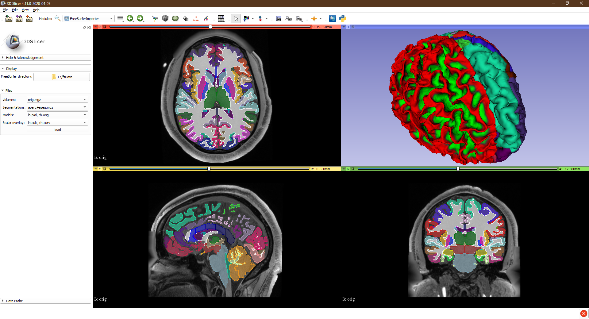

# SlicerFreeSurferImporter

This repository contains the SlicerFreeSurferImporter extension for 3D Slicer.
The extension implements a module for importing models, scalar overlays, and segmentations from FreeSurfer, as well as handling the transformation of models from FreeSurfer to Slicer coordinates.

## Tutorials

### Importing models
To import FreeSurfer mesh into Slicer in the correct position, the MRI volume which contains the mesh coordinate system must already be loaded.
- Drag and drop the model into Slicer
- Choose "FreeSurfer model" description
- Click "Show options"
- Select the reference volume
- Click OK

The model is added to a parent transform (named FSModel_XYZToWorld) that translates it from FreeSufer coordinates into Slicer world coordinates.

### Importing scalar overlay
- Drag and drop the scalar overlay file into Slicer
- Choose "FreeSurfer scalar overlay" description
- Click "Show options"
- Select the mesh that the overlay should be applied to
- Click OK

### Importing segmentations
- Drag and drop the segmentation file into Slicer
- Choose "FreeSurfer segmentation" description
- Click OK

## Resources

Sample data: https://surfer.nmr.mgh.harvard.edu/fswiki/FsTutorial/Data

FreeSurfer homepage: https://surfer.nmr.mgh.harvard.edu/
