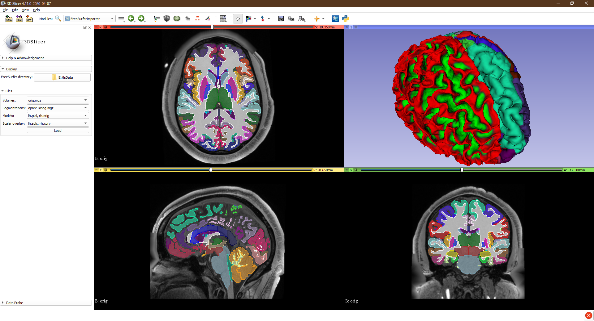

# SlicerFreeSurfer

This repository contains the SlicerFreeSurfer extension for 3D Slicer.
The extension implements a module for importing models, scalar overlays, and segmentations from FreeSurfer, as well as handling the transformation of models from FreeSurfer to Slicer coordinates.

## Tutorials

Tutorials can be found in the wiki: https://github.com/PerkLab/SlicerFreeSurfer/wiki/Tutorials

## Resources

Sample data: https://surfer.nmr.mgh.harvard.edu/fswiki/FsTutorial/Data

FreeSurfer homepage: https://surfer.nmr.mgh.harvard.edu/
